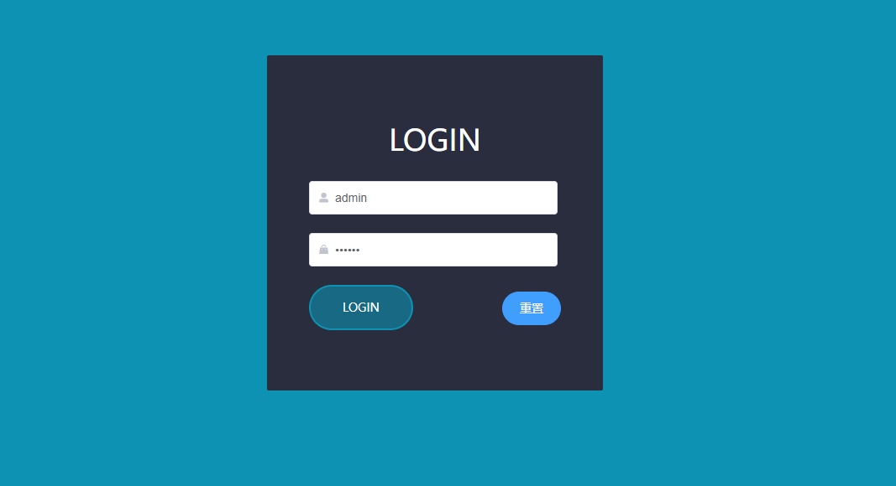
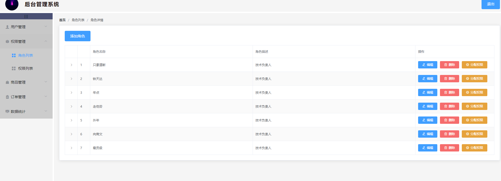
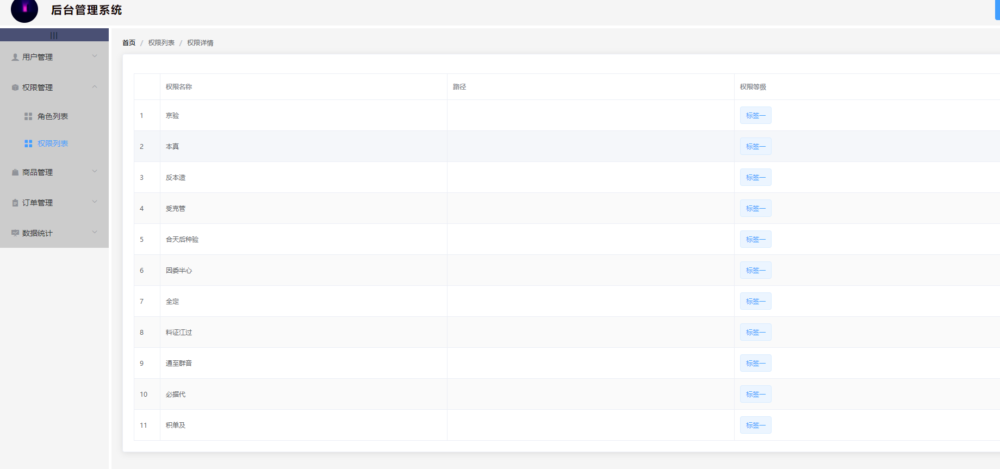
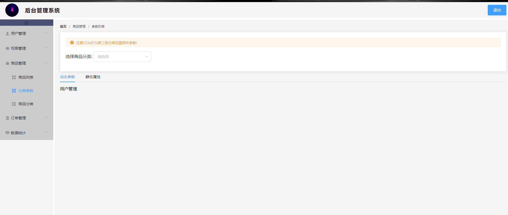
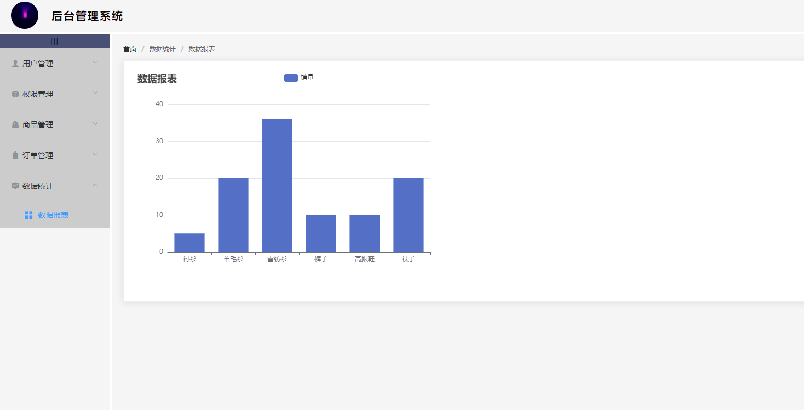

## `后台管理系统` github 地址
<https://github.com/clozz-lin/admin_shop>
 

## 1、功能
+ `登录页`
+ `用户列表`
+ `角色列表`
+ `权限列表`
+ `参数列表`
+ `数据报表`
## 2、接口
  接口是用的`mock`

## 3、项目截图
### 1.登录页

### 2.用户列表

### 3.角色列表

### 4.权限列表

### 5.参数列表

### 6.数据报表

